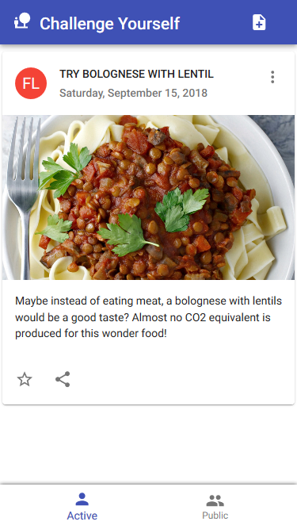
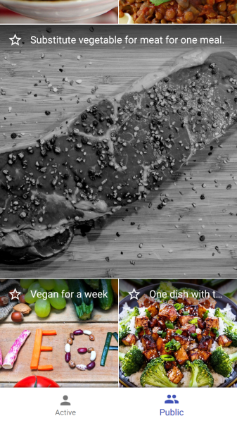
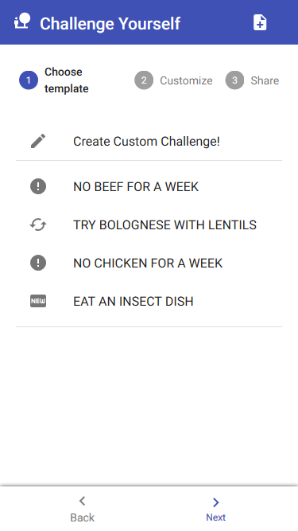
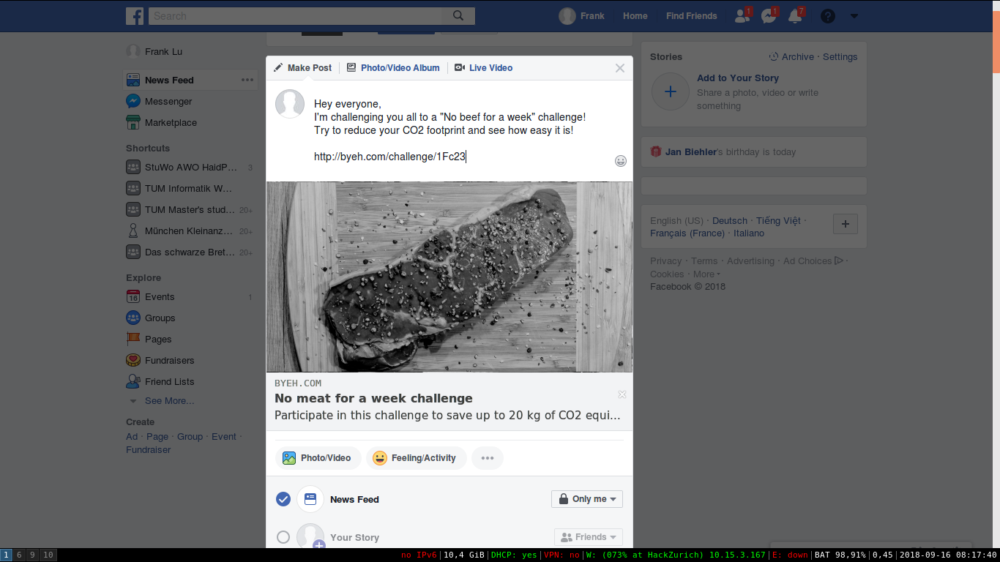

# Break Your Eating Habits!
> Note: All the data in the project is mocked up. This web app should just demonstrate the concept of our idea.

{float: left;}

 

 

#### Inspiration
Resource waste and global warming affect us all. With simple steps we can reduce our carbon footprint.

#### What it does
Challenge yourself and your friends to reduce carbon emissions by trying new eating habits. The application allows you to create and accept challenges. Example challenges are:
 - no beef for a week
 - try an insect dish...

#### How we built it
We've built a mobile web app using ReactJS and our indefinite love for the environment! <3

#### Challenges we ran into
Finding an app that could be appealing for people who aren't the most interested in this topic. 

#### Accomplishments that we're proud of
Creative and interesting to use UI
